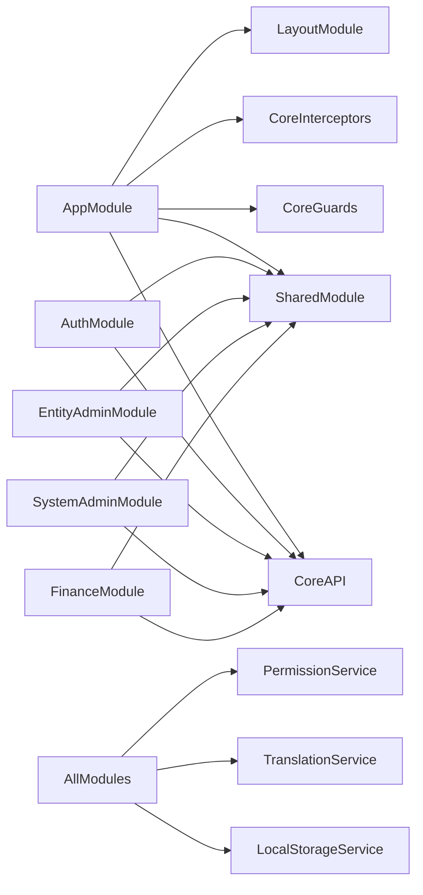
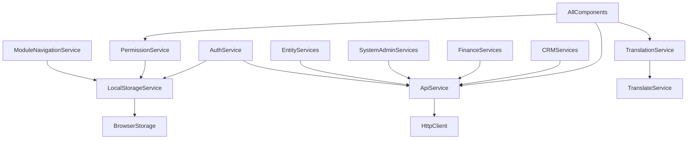

# ERP Frontend Application Documentation

Version: 1.0  
Date: 2024  
Application: ERP System Frontend  
Framework: Angular 17

---

## Table of Contents

1. [System Overview](#1-system-overview)
2. [Project Architecture](#2-project-architecture)
3. [Complete Folder Structure](#3-complete-folder-structure)
4. [Core Layer Architecture](#4-core-layer-architecture)
5. [Layout Architecture](#5-layout-architecture)
6. [Feature Modules Architecture](#6-feature-modules-architecture)
7. [Shared Resources](#7-shared-resources)
8. [Assets and Resources](#8-assets-and-resources)
9. [Routing Architecture](#9-routing-architecture)
10. [Build Configuration](#10-build-configuration)
11. [Module Dependencies](#11-module-dependencies)
12. [File Naming Conventions](#12-file-naming-conventions)
13. [Directory Purpose Reference](#13-directory-purpose-reference)
14. [Appendices](#appendices)

---

## 1. System Overview

### 1.1 Application Information

-   Application Name: ERP System Frontend
-   Version: 17.0.0
-   Framework: Angular 17.0.5
-   UI Library: PrimeNG 17.2.0
-   Build Tool: Angular CLI 17.0.5
-   Language: TypeScript 5.2.2
-   Package Manager: npm

### 1.2 Technology Stack

Core Framework

-   Angular: 17.0.5 (Modular architecture with lazy loading)
-   TypeScript: 5.2.2 (Type-safe development)
-   RxJS: 7.8.1 (Reactive programming)

UI Libraries

-   PrimeNG: 17.2.0 (Component library)
-   PrimeFlex: 3.3.1 (CSS utility library)
-   PrimeIcons: 6.0.1 (Icon library)
-   FontAwesome: 6.4.0 (Additional icons)

State Management & Storage

-   RxJS: Observable-based state management
-   LocalStorage: Browser-based persistence
-   Session Storage: Temporary session data

HTTP & API Communication

-   Angular HttpClient: Native HTTP client
-   Custom API Service: Centralized API communication layer
-   Interceptors: Request/response interceptors for authentication and error handling

Internationalization

-   ngx-translate: 15.0.0 (Translation framework)
-   ngx-translate-messageformat-compiler: 7.0.0 (Message format support)
-   Supported Languages: English (en), Arabic (ar)

Data Visualization

-   Chart.js: 3.9.1 (Charting library)
-   ng2-charts: 3.1.2 (Angular wrapper for Chart.js)
-   chartjs-plugin-datalabels: 2.2.0 (Chart labels)
-   chartjs-gauge: 0.3.0 (Gauge charts)
-   gauge-chart: 1.0.0 (Additional gauge support)

Document & File Handling

-   jsPDF: 2.5.2 (PDF generation)
-   jspdf-autotable: 3.8.4 (PDF tables)
-   html2pdf.js: 0.9.0 (HTML to PDF conversion)
-   html2canvas: 1.4.1 (Canvas rendering)
-   pdfjs-dist: 4.3.136 (PDF.js library)
-   ExcelJS: 4.4.0 (Excel file handling)
-   file-saver: 2.0.5 (File download)

Rich Text Editing

-   ngx-editor: 17.5.4 (Rich text editor)
-   Quill: 2.0.2 (Rich text editor core)
-   Summernote: (via assets/rich-text)

Utilities

-   crypto-js: 4.2.0 (Encryption utilities)
-   guid-ts: 1.1.2 (GUID generation)
-   intl-tel-input: 19.2.3 (International phone input)
-   @justin-s/ngx-intl-tel-input: 17.0.0 (Angular wrapper)
-   canvas-confetti: 1.9.3 (Confetti animations)
-   intro.js: 8.0.0-beta.1 (User onboarding)
-   turn.js: 1.0.2 (Page flip effects)

Calendar & Scheduling

-   @fullcalendar/angular: 6.0.3 (Calendar component)
-   @fullcalendar/core: 6.0.3
-   @fullcalendar/daygrid: 6.0.3
-   @fullcalendar/interaction: 6.0.3
-   @fullcalendar/timegrid: 6.0.3

Real-time Communication

-   @microsoft/signalr: 8.0.7 (SignalR client)

---

## 2. Project Architecture

### 2.1 High-Level Architecture

The application follows a modular monolith architecture with lazy-loaded feature modules. The architecture is organized into three main layers:

1. Core Layer (`src/app/core/`): Singleton services, guards, interceptors (global scope)
2. Feature Modules Layer (`src/app/modules/`): Business logic modules (lazy-loaded)
3. Shared Layer (`src/app/Shared/`): Reusable components, pipes, directives

### 2.2 Architecture Diagram

```mermaid
graph TB
    subgraph "Application Layer"
        AppModule[App Module]
        AppRouting[App Routing]
    end

    subgraph "Core Layer"
        CoreAPI[API Service]
        CoreGuards[Auth Guards]
        CoreInterceptors[HTTP Interceptors]
        CoreServices[Global Services]
        CoreModels[Shared Models]
    end

    subgraph "Layout Layer"
        AppLayout[App Layout Component]
        TopBar[Top Bar]
        Sidebar[Sidebar]
        Menu[Dynamic Menu]
        Footer[Footer]
    end

    subgraph "Feature Modules"
        AuthModule[Auth Module]
        EntityAdmin[Entity Administration]
        SystemAdmin[System Administration]
        CRM[Customer Relations]
        Finance[Finance & Accounting]
        SCM[Supply Chain]
        ProjectCtrl[Project Controls]
        DocControl[Document Control]
        Dashboard[Dashboard]
        Summary[Summary]
    end

    subgraph "Shared Layer"
        SharedComponents[Shared Components]
        SharedModules[Shared Modules]
    end

    AppModule --> AppRouting
    AppRouting --> AppLayout
    AppLayout --> TopBar
    AppLayout --> Sidebar
    AppLayout --> Menu
    AppLayout --> Footer

    AppModule --> CoreAPI
    AppModule --> CoreGuards
    AppModule --> CoreInterceptors
    AppModule --> CoreServices

    AppRouting --> AuthModule
    AppRouting --> EntityAdmin
    AppRouting --> SystemAdmin
    AppRouting --> CRM
    AppRouting --> Finance
    AppRouting --> SCM
    AppRouting --> ProjectCtrl
    AppRouting --> DocControl
    AppRouting --> Dashboard
    AppRouting --> Summary

    AuthModule --> CoreAPI
    EntityAdmin --> CoreAPI
    SystemAdmin --> CoreAPI
    CRM --> CoreAPI
    Finance --> CoreAPI

    AuthModule --> SharedComponents
    EntityAdmin --> SharedComponents
    SystemAdmin --> SharedComponents
```



### 2.3 Module Organization Strategy

Lazy Loading

All feature modules are lazy-loaded for optimal performance. Modules are loaded on-demand when their routes are accessed, reducing initial bundle size.

Route Protection

-   AuthGuard: Protects all authenticated routes by verifying token presence
-   Module Guards: Additional guards can be implemented per module for fine-grained access control

Service Pattern

-   Singleton Services: Core services are provided in root, ensuring single instance
-   Feature Services: Module-specific services handle business logic
-   API Service: Centralized HTTP communication through `ApiService`

Component Pattern

-   Presentation Components: Handle UI rendering and user interaction
-   Container Components: Manage state and business logic
-   Shared Components: Reusable across multiple modules

State Management

-   RxJS Observables: Used for reactive state management
-   LocalStorage: Persistent storage for user data, tokens, and settings
-   BehaviorSubject: Used in services for state sharing

---

## 3. Complete Folder Structure

### 3.1 Root Directory Structure

```
ERP-front/
├── .angular/                    # Angular build cache
├── .cursor/                     # Cursor IDE configuration
├── dist/                        # Build output directory
│   └── avalon-ng/              # Production build files
├── Docs/                        # Documentation files
│   ├── Account_and_Session_Management.md
│   ├── Folder_Structure_Map.md
│   ├── Technical_Reference_Manual.md
│   └── ERP APIs– (1A-F) Account and Session Management (v6.1) images/
├── node_modules/               # npm dependencies
├── src/                        # Source code directory
├── angular.json                 # Angular CLI configuration
├── package.json                # npm package configuration
├── package-lock.json           # Dependency lock file
├── tsconfig.json               # TypeScript configuration
├── tsconfig.app.json           # TypeScript app configuration
├── tsconfig.spec.json          # TypeScript test configuration
├── README.md                   # Project readme
├── CHANGELOG.md                # Version changelog
├── deploy.md                   # Deployment instructions
├── MODULE_URLS_DATABASE.md     # Module URL mappings
└── timesheet-instructions.md   # Timesheet feature documentation
```

### 3.2 Source Directory (`src/`)

```
src/
├── app/                        # Application source code
├── assets/                     # Static assets
├── environments/               # Environment configurations
│   ├── environment.ts          # Development environment
│   ├── environment.prod.ts     # Production environment
│   └── environmentTest.ts      # Test environment
├── favicon.ico                 # Application favicon
├── index.html                  # Main HTML entry point
├── main.ts                     # Application bootstrap
├── styles.scss                 # Global styles
├── table-loading-spinner.html  # Loading spinner template
└── upload.php                  # File upload handler
```

### 3.3 Application Directory (`src/app/`)

```
src/app/
├── app.component.ts            # Root component
├── app.component.html          # Root template
├── app.component.scss          # Root styles
├── app.component.spec.ts       # Root component tests
├── app.module.ts               # Root module
├── app-routing.module.ts       # Root routing configuration
├── core/                       # Core layer (singleton services)
├── layout/                     # Layout components
├── modules/                    # Feature modules (lazy-loaded)
└── Shared/                     # Shared resources
```

---

## 4. Core Layer Architecture

### 4.1 Core Directory Structure

```
src/app/core/
├── api/                        # API communication
│   ├── api.service.ts          # Centralized HTTP service
│   └── api-result.model.ts     # API response model
├── components/                 # Core UI components
│   ├── coming-soon/            # Coming soon page
│   ├── landing/                # Landing page
│   ├── notfound/               # 404 page
│   └── session-expired-dialog/ # Session expiration dialog
├── directives/                 # Shared directives
│   └── has-role.directive.ts  # Role-based directive
├── enums/                      # Shared enumerations
├── Guards/                     # Route guards
│   └── auth.guard.ts          # Authentication guard
├── Interceptors/               # HTTP interceptors
│   ├── error-handling.interceptor.ts  # Error handling
│   └── loading.interceptor.ts         # Loading indicator
├── models/                     # Shared data models
│   ├── account-status.model.ts # Account status interfaces
│   └── system-roles.ts         # System roles definitions
├── pipes/                      # Shared pipes
│   └── safe.pipe.ts           # Safe HTML pipe
├── services/                   # Global services
│   ├── entity-logo.service.ts  # Entity logo management
│   ├── image.service.ts        # Image handling
│   ├── language-dir.service.ts # Language direction (RTL/LTR)
│   ├── Loading.service.ts      # Loading state management
│   ├── local-storage.service.ts # LocalStorage wrapper
│   ├── module-navigation.service.ts # Module navigation logic
│   ├── network-status.service.ts # Network connectivity
│   ├── passwordMatchValidator.ts # Password validation
│   ├── permission.service.ts   # Permission checking
│   ├── profile-picture.service.ts # Profile picture handling
│   ├── translation.service.ts  # Translation utilities
│   └── user-name.service.ts    # User name formatting
└── validators/                 # Shared form validators
    ├── password-match.validator.ts # Password matching
    └── text-field.validator.ts    # Text field validation
```

### 4.2 Core Components

API Service (`api/api.service.ts`)

Purpose: Centralized HTTP communication gateway for all backend API calls.

Key Features:

-   Request packing: Converts request data to byte array format
-   Response unpacking: Parses byte array responses
-   Error handling: Centralized error management
-   Token management: Automatic access token handling

Usage Pattern:

```typescript
// All API calls go through ApiService
this.apiService.call(requestCode, accessToken, parameters);
```

Auth Guard (`Guards/auth.guard.ts`)

Purpose: Protects routes by verifying user authentication.

Logic:

1. Checks for valid token in localStorage
2. Allows access if token exists
3. Redirects to `/auth` if no token found

Applied To: All protected routes in `app-routing.module.ts`

HTTP Interceptors

Error Handling Interceptor (`Interceptors/error-handling.interceptor.ts`)

-   Intercepts HTTP errors
-   Provides centralized error handling
-   Can show error messages or redirect

Loading Interceptor (`Interceptors/loading.interceptor.ts`)

-   Manages loading state for HTTP requests
-   Shows/hides loading indicators
-   Tracks request progress

### 4.3 Core Services Catalog

| Service                   | Purpose                         | Location                                |
| ------------------------- | ------------------------------- | --------------------------------------- |
| `ApiService`              | Centralized HTTP communication  | `api/api.service.ts`                    |
| `LocalStorageService`     | Type-safe localStorage wrapper  | `services/local-storage.service.ts`     |
| `ModuleNavigationService` | Dynamic module navigation logic | `services/module-navigation.service.ts` |
| `TranslationService`      | Translation utilities           | `services/translation.service.ts`       |
| `PermissionService`       | Permission checking             | `services/permission.service.ts`        |
| `LoadingService`          | Loading state management        | `services/Loading.service.ts`           |
| `NetworkStatusService`    | Network connectivity monitoring | `services/network-status.service.ts`    |
| `ImageService`            | Image handling utilities        | `services/image.service.ts`             |
| `EntityLogoService`       | Entity logo management          | `services/entity-logo.service.ts`       |
| `ProfilePictureService`   | Profile picture handling        | `services/profile-picture.service.ts`   |
| `UserNameService`         | User name formatting            | `services/user-name.service.ts`         |
| `LanguageDirService`      | Language direction (RTL/LTR)    | `services/language-dir.service.ts`      |

### 4.4 Core Models

Account Status Model (`models/account-status.model.ts`)

Contains interfaces for:

-   `IFunctionsDetails`: Function definitions
-   `IModulesDetails`: Module definitions
-   `IModuleDetail`: Individual module details
-   `IFunctionDetail`: Individual function details
-   `IAccountSettings`: Account configuration
-   `IMenuFunction`: Menu function structure
-   `IMenuModule`: Menu module structure

System Roles (`models/system-roles.ts`)

Defines system role constants and enumerations.

---

## 5. Layout Architecture

### 5.1 Layout Directory Structure

```
src/app/layout/
├── app-breadcrumb/             # Breadcrumb navigation
│   ├── app.breadcrumb.component.html
│   └── app.breadcrumb.component.ts
├── app-footer/                 # Application footer
│   ├── app.footer.component.html
│   └── app.footer.component.ts
├── app-layout/                 # Main layout container
│   ├── app.layout.component.html
│   ├── app.layout.component.ts
│   └── app.layout.module.ts
├── app-menu/                   # Main navigation menu
│   ├── app.menu.component.html
│   ├── app.menu.component.ts
│   ├── app.menu.service.ts
│   ├── app.menuitem.component.ts
│   └── menuchangeevent.ts
├── app-menuProfile/            # User profile menu
│   ├── app.menuprofile.component.html
│   └── app.menuprofile.component.ts
├── app-rightMenu/              # Right-side menu
│   ├── app.rightmenu.component.html
│   └── app.rightmenu.component.ts
├── app-services/               # Layout services
│   └── app.layout.service.ts
├── app-sidebar/                # Sidebar component
│   ├── app.sidebar.component.html
│   └── app.sidebar.component.ts
├── config/                     # Configuration panel
│   ├── app.config.component.html
│   ├── app.config.component.ts
│   └── app.config.module.ts
├── no-internet-overlay/        # Network status overlay
│   ├── no-internet-overlay.component.html
│   ├── no-internet-overlay.component.scss
│   └── no-internet-overlay.component.ts
└── top-bar/                    # Top navigation bar
    ├── app.topbar.component.html
    ├── app.topbar.component.scss
    └── app.topbar.component.ts
```

### 5.2 Layout Components

App Layout (`app-layout/`)

Purpose: Main application shell that wraps all authenticated pages.

Structure:

-   Contains sidebar, top bar, menu, and content area
-   Manages layout state (sidebar collapsed/expanded)
-   Handles responsive behavior

Top Bar (`top-bar/`)

Purpose: Header navigation bar.

Features:

-   User profile menu
-   Notifications
-   Search functionality
-   Theme toggle
-   Language selector

Sidebar (`app-sidebar/`)

Purpose: Left navigation sidebar.

Features:

-   Collapsible/expandable
-   Module navigation
-   Responsive behavior

Menu (`app-menu/`)

Purpose: Dynamic navigation menu system.

Features:

-   Dynamic menu generation from Functions and Modules
-   Hierarchical menu structure
-   Active route highlighting
-   Menu state management via `AppMenuService`

Breadcrumb (`app-breadcrumb/`)

Purpose: Navigation breadcrumb trail.

Features:

-   Automatic generation from route data
-   Clickable navigation
-   Localized labels

Footer (`app-footer/`)

Purpose: Application footer.

Features:

-   Copyright information
-   Version display
-   Additional links

Config (`config/`)

Purpose: Theme and configuration panel.

Features:

-   Theme selection
-   Layout options
-   Color scheme customization

Menu Profile (`app-menuProfile/`)

Purpose: User profile dropdown menu.

Features:

-   User information display
-   Profile settings link
-   Logout option

Right Menu (`app-rightMenu/`)

Purpose: Right-side navigation menu.

Features:

-   Additional navigation options
-   Quick actions

No Internet Overlay (`no-internet-overlay/`)

Purpose: Network connectivity indicator.

Features:

-   Shows when network is offline
-   Blocks interaction when offline
-   Auto-hides when connection restored

---

## 6. Feature Modules Architecture

### 6.1 Modules Directory Structure

```
src/app/modules/
├── auth/                       # Authentication module
├── dashboard/                  # Dashboard module
├── summary/                    # Summary module (profile, settings, etc.)
├── entity-administration/      # Entity administration module
├── system-administration/      # System administration module
├── customer-relation-management/  # CRM module
├── finance-accounting/         # Finance & accounting module
├── supply-chain-management/    # Supply chain module
├── project-controls/           # Project controls module
└── document-control/           # Document management module
```

### 6.2 Module Breakdown

6.2.1 Authentication Module (`auth/`)

Purpose: User authentication and session management.

Structure:

```
auth/
├── auth.module.ts
├── auth-routing.module.ts
├── components/
│   ├── login/                  # Login page
│   ├── logout/                 # Logout handler
│   ├── forget-password/        # Password recovery
│   ├── reset-password/         # Password reset
│   ├── verify-2fa/             # Two-factor authentication
│   ├── verification-email/     # Email verification
│   ├── email-verified/         # Email verified confirmation
│   └── account-status/          # Account status display
├── models/                     # Auth-related models
└── services/
    └── auth.service.ts         # Authentication service
```

Routes:

-   `/auth` - Login page
-   `/auth/forget-password` - Password recovery
-   `/auth/reset-password` - Password reset
-   `/auth/verify-2fa/:email` - 2FA verification
-   `/auth/verify-email` - Email verification
-   `/auth/email-verified` - Email verified confirmation
-   `/auth/account-status` - Account status

Key Features:

-   User login with credentials
-   Two-factor authentication (2FA)
-   Password recovery flow
-   Email verification
-   Account status checking
-   Session management

6.2.2 Entity Administration Module (`entity-administration/`)

Purpose: Managing organizational structure, users, roles, and permissions.

Structure:

```
entity-administration/
├── entity-administration.module.ts
├── entity-administration-routing.module.ts
├── entities/                   # Company/Branch management
│   ├── entities.module.ts
│   ├── entities-routing.module.ts
│   ├── components/
│   │   └── Entity/             # Entity CRUD components
│   ├── models/
│   │   └── entities.model.ts
│   └── services/
│       └── entities.service.ts
├── entity-accounts/            # Entity account management
│   ├── entity-accounts.module.ts
│   ├── entity-accounts-routing.module.ts
│   └── components/             # Entity account components
├── user-accounts/              # User management
│   ├── user-accounts.module.ts
│   ├── user-accounts-routing.module.ts
│   ├── components/             # User CRUD components
│   ├── models/                 # User models
│   ├── services/               # User services
│   └── users-details/          # User details
├── roles/                      # Role and permission management
│   ├── roles.module.ts
│   ├── roles-routing.module.ts
│   ├── components/
│   │   ├── Role/               # Role CRUD
│   │   ├── Permissions/        # Permission management
│   │   └── Assignment/         # Role assignment
│   ├── models/                 # Role models
│   └── services/               # Role services
└── workflows/                  # Workflow management
    ├── workflows.component.html
    ├── workflows.component.scss
    └── workflows.component.ts
```

Routes:

-   `/company-administration` - Main route
-   `/company-administration/entities` - Entity management
-   `/company-administration/user-accounts` - User management
-   `/company-administration/roles` - Role management
-   `/company-administration/workflows` - Workflow management

Key Features:

-   Entity (company/branch) CRUD operations
-   User account management
-   Role-based access control (RBAC)
-   Permission assignment
-   Workflow configuration

6.2.3 System Administration Module (`system-administration/`)

Purpose: Global system configuration and ERP feature management.

Structure:

```
system-administration/
├── system-administration.module.ts
├── system-administration-routing.module.ts
├── settings-configurations.model.ts
├── settings-configurations.service.ts
├── erp-functions/              # ERP Functions management
│   ├── erp-functions.module.ts
│   ├── erp-functions-routing.module.ts
│   ├── components/            # Function CRUD components
│   ├── models/                # Function models
│   └── services/              # Function services
├── erp-modules/               # ERP Modules management
│   ├── erp-modules.module.ts
│   ├── erp-modules-routing.module.ts
│   ├── components/            # Module CRUD components
│   ├── models/                # Module models
│   └── services/              # Module services
└── system-control-panel/      # System control panel
```

Routes:

-   `/system-administration` - Main route
-   `/system-administration/erp-functions` - Functions management
-   `/system-administration/erp-modules` - Modules management

Key Features:

-   ERP Functions configuration
-   ERP Modules licensing and activation
-   System-wide settings
-   Control panel for system configuration

Important Distinction:

-   ERP Functions: High-level capabilities/features of the system
-   ERP Modules: Licensed modules that can be enabled/disabled per entity
-   Angular Modules: Code organization units (folders in `src/app/modules/`)

6.2.4 Customer Relation Management Module (`customer-relation-management/`)

Purpose: Managing customer relationships, tenders, estimates, and contracts.

Structure:

```
customer-relation-management/
├── clients-details/            # Client database
├── tendering/                  # Tender management
├── estimation/                 # Project estimation
├── main-contracts/             # Main contract management
└── customers-invoicing/        # Customer invoicing
```

Routes:

-   Routes are dynamically generated based on module configuration

Key Features:

-   Client database management
-   Tender creation and tracking
-   Project estimation tools
-   Contract management
-   Customer invoicing

6.2.5 Finance & Accounting Module (`finance-accounting/`)

Purpose: Financial transactions, accounting, and reporting.

Structure:

```
finance-accounting/
├── financials.module.ts
├── financials-routing.module.ts
├── general-ledger/            # General ledger
├── chart-of-accounts/         # Chart of accounts
├── account-payables/          # Vendor payables
├── account-receivables/       # Customer receivables
└── components/
    └── invoices/              # Invoice components
        ├── invoices.component.html
        ├── invoices.component.scss
        └── invoices.component.ts
```

Routes:

-   `/financials` - Main route
-   `/financials/invoices` - Invoice management

Key Features:

-   General ledger entries
-   Chart of accounts hierarchy
-   Accounts payable (vendor invoices)
-   Accounts receivable (customer invoices)
-   Financial reporting

6.2.6 Supply Chain Management Module (`supply-chain-management/`)

Purpose: Procurement, vendor management, and supply chain operations.

Structure:

```
supply-chain-management/
├── purchase-orders/           # Purchase order management
├── subcontracts/              # Subcontract management
├── vendors-details/            # Vendor database
└── vendors-invoicing/          # Vendor invoicing
```

Routes:

-   Routes are dynamically generated based on module configuration

Key Features:

-   Purchase order creation and tracking
-   Subcontract management
-   Vendor database
-   Vendor invoicing and payments

6.2.7 Project Controls Module (`project-controls/`)

Purpose: Project planning, budgeting, cost control, and progress tracking.

Structure:

```
project-controls/
├── budgeting/                 # Project budgeting
├── work-breakdown-structure/  # WBS management
├── cost-breakdown-structure/  # CBS management
├── quantity-surveying/        # Quantity surveying
├── cost-reports/              # Cost reporting
└── progress-reports/          # Progress reporting
```

Routes:

-   Routes are dynamically generated based on module configuration

Key Features:

-   Project budgeting
-   Work Breakdown Structure (WBS)
-   Cost Breakdown Structure (CBS)
-   Quantity surveying
-   Cost tracking and reporting
-   Progress monitoring

6.2.8 Document Control Module (`document-control/`)

Purpose: Document management and file organization.

Structure:

```
document-control/
├── shared-documents/          # Shared document management
│   ├── shared-documents.module.ts
│   ├── shared-documents-routing.module.ts
│   └── components/            # Document components
└── components/                 # Additional document components
```

Routes:

-   `/document-control` - Main route

Key Features:

-   Document upload and storage
-   File organization
-   Document sharing
-   Version control
-   Document search

6.2.9 Dashboard Module (`dashboard/`)

Purpose: Main application dashboard with overview and analytics.

Structure:

```
dashboard/
├── dashboard.module.ts
├── dashboard.component.html
├── dashboard.component.scss
└── dashboard.component.ts
```

Routes:

-   `/` - Root route (default dashboard)

Key Features:

-   Overview widgets
-   Key performance indicators (KPIs)
-   Quick access to modules
-   Recent activities
-   Dynamic module display based on user permissions

6.2.10 Summary Module (`summary/`)

Purpose: User profile, settings, notifications, and actions.

Structure:

```
summary/
├── summary.module.ts
├── summary-routing.module.ts
├── components/
│   ├── profile/               # User profile
│   ├── settings/              # User settings
│   ├── notifications/         # Notifications
│   └── actions/                # User actions
├── models/
│   ├── actions.model.ts
│   ├── notifications.model.ts
│   ├── profile.model.ts
│   └── settings.model.ts
└── services/
    ├── actions.service.ts
    ├── notifications.service.ts
    ├── profile-api.service.ts
    ├── settings-api.service.ts
    └── settings.service.ts
```

Routes:

-   `/summary` - Main route
-   `/summary/profile` - User profile
-   `/summary/settings` - User settings
-   `/summary/notifications` - Notifications
-   `/summary/actions` - User actions

Key Features:

-   User profile management
-   Account settings
-   Notification center
-   Action history

---

## 7. Shared Resources

### 7.1 Shared Directory Structure

```
src/app/Shared/
├── components/                # Reusable UI components
│   ├── color-scema-settings/  # Color scheme settings
│   ├── erp-info/              # ERP information display
│   ├── erp-rich-text/         # Rich text editor wrapper
│   ├── erp-variables/         # ERP variables component
│   └── table-loading-spinner/ # Table loading indicator
└── shared/                    # Shared modules
    ├── app-translate.module.ts # Translation module
    └── shared.module.ts       # Shared Angular module
```

### 7.2 Shared Components

Color Schema Settings (`color-scema-settings/`)

Purpose: Color scheme configuration component.

Usage: Used in theme configuration panels.

ERP Info (`erp-info/`)

Purpose: Displays ERP system information.

Usage: About pages, system information displays.

ERP Rich Text (`erp-rich-text/`)

Purpose: Wrapper component for rich text editing.

Usage: Forms requiring rich text input.

ERP Variables (`erp-variables/`)

Purpose: Manages ERP system variables.

Usage: Configuration pages, system settings.

Table Loading Spinner (`table-loading-spinner/`)

Purpose: Loading indicator for data tables.

Usage: PrimeNG tables during data loading.

### 7.3 Shared Modules

SharedModule (`shared/shared.module.ts`)

Purpose: Common Angular modules and components shared across the application.

Exports:

-   CommonModule
-   FormsModule
-   ReactiveFormsModule
-   PrimeNG components
-   Other shared modules

AppTranslateModule (`shared/app-translate.module.ts`)

Purpose: Translation module configuration.

Features:

-   ngx-translate setup
-   HTTP loader configuration
-   Message format compiler
-   Language switching

---

## 8. Assets and Resources

### 8.1 Assets Directory Structure

```
src/assets/
├── customIcons/                # Custom SVG icons
│   ├── linux.svg
│   ├── mac.svg
│   └── windows.svg
├── demo/                      # Demo data and assets
│   ├── data/                  # JSON demo data files
│   ├── images/                # Demo images
│   └── styles/                # Demo styles
├── i18n/                      # Translation files
│   ├── ar.json                # Arabic translations
│   └── en.json                # English translations
├── images/                    # Application images
│   ├── companyDefaultLogo.png
│   ├── email_verification.jpg
│   └── quantum_logo.png
├── layout/                    # Layout assets
│   ├── fonts/                 # Custom fonts
│   ├── images/                # Layout images
│   └── styles/                # Theme and layout styles
├── media/                     # Media files
├── pdfjs/                     # PDF.js library
│   └── pdf.worker.min.js
└── rich-text/                 # Rich text editor assets
    ├── jquery-3.4.1.slim.min.js
    ├── summernote-lite.min.css
    ├── summernote-lite.min.js
    └── summernote fonts
```

### 8.2 Asset Categories

Custom Icons (`customIcons/`)

-   Platform-specific icons (Linux, Mac, Windows)
-   Custom SVG icons for application use

Demo Assets (`demo/`)

-   Data: JSON files for demo/testing purposes
    -   `chat.json`, `countries.json`, `customers-*.json`
    -   `files.json`, `products.json`, `tasks.json`
-   Images: Demo images for UI components
    -   Avatars, product images, blog images
-   Styles: Demo-specific stylesheets

Internationalization (`i18n/`)

-   ar.json: Arabic translation keys and values
-   en.json: English translation keys and values
-   Format: Key-value pairs for all translatable strings

Application Images (`images/`)

-   Company logos
-   Email verification images
-   Application branding

Layout Assets (`layout/`)

-   Fonts: Custom Roboto font files (woff, woff2)
-   Images: Layout-specific images
    -   Avatars, logos, dashboard images
    -   Configurator images
    -   Exception pages images
-   Styles: Theme and layout stylesheets
    -   Layout styles (40+ SCSS files)
    -   Theme styles (100+ SCSS files)

Media Files (`media/`)

-   Various media assets
-   Icons and images for specific features
-   Logo variations

PDF.js (`pdfjs/`)

-   PDF.js worker file for PDF rendering
-   Required for PDF viewing functionality

Rich Text Assets (`rich-text/`)

-   jQuery library (for Summernote)
-   Summernote editor files
-   Summernote fonts (eot, ttf, woff, woff2)

---

## 9. Routing Architecture

### 9.1 Route Configuration

The application uses Angular's RouterModule with lazy loading for all feature modules.

Root Routes (`app-routing.module.ts`)

```typescript
Routes Structure:
├── / (AppLayoutComponent)
│   ├── '' → DashboardModule (lazy)
│   ├── summary → SummaryModule (lazy)
│   ├── system-administration → SystemAdministrationModule (lazy)
│   ├── company-administration → EntityAdministrationModule (lazy)
│   ├── document-control → SharedDocumentsModule (lazy)
│   └── financials → FinancialsModule (lazy)
├── /auth → AuthModule (lazy)
├── /GetQuote → AuthModule (lazy)
├── /notfound → NotfoundModule (lazy)
├── /landing → LandingModule (lazy)
└──  → redirect to /notfound
```

### 9.2 Route Hierarchy

Public Routes

-   `/auth/*` - Authentication pages (no guard)
-   `/landing` - Landing page (no guard)
-   `/notfound` - 404 page (no guard)
-   `/GetQuote` - Quote request (no guard)

Protected Routes

All routes under `AppLayoutComponent` are protected by `AuthGuard`:

-   `/` - Dashboard
-   `/summary/*` - User summary pages
-   `/system-administration/*` - System admin
-   `/company-administration/*` - Entity admin
-   `/document-control/*` - Document control
-   `/financials/*` - Finance module

### 9.3 Module-Specific Routes

Authentication Routes (`auth-routing.module.ts`)

```
/auth
├── '' → LoginComponent
├── /forget-password → ForgetPasswordComponent
├── /reset-password → ResetPasswordComponent
├── /verify-2fa/:email → Verify2FAComponent
├── /verify-email → VerificationEmailComponent
├── /email-verified → EmailVerifiedComponent
└── /account-status → AccountStatusComponent
```

Entity Administration Routes (`entity-administration-routing.module.ts`)

```
/company-administration
├── '' → redirect to /entities/list
├── /entities → EntitiesModule (lazy)
├── /roles → RolesModule (lazy)
├── /user-accounts → UserAccountsModule (lazy)
└── /workflows → WorkflowsComponent
```

System Administration Routes (`system-administration-routing.module.ts`)

```
/system-administration
├── '' → redirect to /dashboard
├── /erp-functions → ErpFunctionsModule (lazy)
└── /erp-modules → ErpModulesModule (lazy)
```

Finance Routes (`financials-routing.module.ts`)

```
/financials
└── '' → InvoicesComponent
```

Summary Routes (`summary-routing.module.ts`)

```
/summary
├── /profile → ProfileComponent
├── /settings → SettingsComponent
├── /notifications → NotificationsComponent
└── /actions → ActionsComponent
```

### 9.4 Route Guards

AuthGuard

-   Location: `core/Guards/auth.guard.ts`
-   Purpose: Verifies user authentication
-   Logic: Checks for token in localStorage
-   Applied To: All routes under AppLayoutComponent

### 9.5 Dynamic Routing

The application supports dynamic module routing through `ModuleNavigationService`:

-   Modules are loaded based on user permissions
-   Routes are generated from Functions and Modules data
-   Menu structure reflects available modules

---

## 10. Build Configuration

### 10.1 Angular Configuration

File: `angular.json`

Project Configuration

-   Project Name: avalon-ng
-   Project Type: application
-   Root: `""`
-   Source Root: `src`
-   Prefix: `app`

Build Options

-   Output Path: `dist/avalon-ng`
-   Index: `src/index.html`
-   Main: `src/main.ts`
-   Polyfills: `zone.js`
-   TSConfig: `tsconfig.app.json`
-   Inline Style Language: `scss`

Assets

-   `src/.htaccess`
-   `src/favicon.ico`
-   `src/assets`
-   Monaco Editor assets from node_modules

Styles

-   `src/styles.scss`
-   FontAwesome CSS
-   Quill CSS
-   Intro.js CSS
-   International Tel Input CSS
-   Summernote CSS

Scripts

-   Quill.js
-   jQuery
-   Summernote
-   Intro.js

### 10.2 Build Configurations

Development Configuration

-   Build Optimizer: false
-   Optimization: false
-   Vendor Chunk: true
-   Extract Licenses: false
-   Source Map: false
-   Named Chunks: true

Production Configuration

-   File Replacements: `environment.ts` → `environment.prod.ts`
-   Output Hashing: all
-   Budgets: - Initial: 8mb (warning/error)
    -   Component Styles: 8mb (warning/error)

Testing Configuration

-   File Replacements: `environment.ts` → `environmentTest.ts`
-   Output Hashing: all
-   Budgets: Same as production

### 10.3 Environment Files

Development (`environment.ts`)

```typescript
export const environment = {
    production: false,
};
```

Production (`environment.prod.ts`)

-   Production-specific configurations
-   API endpoints
-   Feature flags

Test (`environmentTest.ts`)

-   Test environment configurations
-   Test API endpoints

---

## 11. Module Dependencies

### 11.1 External Dependencies

Core Angular Packages

-   `@angular/core`: 17.0.5
-   `@angular/common`: 17.0.5
-   `@angular/forms`: 17.0.5
-   `@angular/router`: 17.0.5
-   `@angular/platform-browser`: 17.0.5
-   `@angular/platform-browser-dynamic`: 17.0.5
-   `@angular/animations`: 17.0.5
-   `@angular/cdk`: 17.0.2

UI Component Libraries

-   `primeng`: 17.2.0
-   `primeflex`: 3.3.1
-   `primeicons`: 6.0.1

Utilities

-   `rxjs`: 7.8.1
-   `tslib`: 2.5.0
-   `zone.js`: 0.14.0

### 11.2 Internal Dependencies

Module Dependency Graph



Service Dependencies

-   ApiService: Used by all feature modules
-   LocalStorageService: Used globally for data persistence
-   ModuleNavigationService: Used by layout components
-   TranslationService: Used for i18n
-   PermissionService: Used for access control

---

## 12. File Naming Conventions

### 12.1 Component Files

Pattern: `component-name.component.{ts|html|scss}`

Examples:

-   `login.component.ts`
-   `login.component.html`
-   `login.component.scss`

### 12.2 Service Files

Pattern: `service-name.service.ts`

Examples:

-   `auth.service.ts`
-   `api.service.ts`
-   `local-storage.service.ts`

### 12.3 Module Files

Pattern: `module-name.module.ts`

Examples:

-   `auth.module.ts`
-   `dashboard.module.ts`
-   `entity-administration.module.ts`

### 12.4 Routing Files

Pattern: `module-name-routing.module.ts`

Examples:

-   `auth-routing.module.ts`
-   `entity-administration-routing.module.ts`
-   `financials-routing.module.ts`

### 12.5 Model Files

Pattern: `model-name.model.ts`

Examples:

-   `account-status.model.ts`
-   `entities.model.ts`
-   `api-result.model.ts`

### 12.6 Guard Files

Pattern: `guard-name.guard.ts`

Examples:

-   `auth.guard.ts`

### 12.7 Interceptor Files

Pattern: `interceptor-name.interceptor.ts`

Examples:

-   `error-handling.interceptor.ts`
-   `loading.interceptor.ts`

### 12.8 Pipe Files

Pattern: `pipe-name.pipe.ts`

Examples:

-   `safe.pipe.ts`

### 12.9 Directive Files

Pattern: `directive-name.directive.ts`

Examples:

-   `has-role.directive.ts`

### 12.10 Validator Files

Pattern: `validator-name.validator.ts`

Examples:

-   `password-match.validator.ts`
-   `text-field.validator.ts`

---

## 13. Directory Purpose Reference

### 13.1 Quick Reference Table

| Directory         | Purpose                        | Location                                        |
| ----------------- | ------------------------------ | ----------------------------------------------- |
| Core API          | Centralized HTTP communication | `src/app/core/api/`                             |
| Guards            | Route protection               | `src/app/core/Guards/`                          |
| Interceptors      | HTTP request/response handling | `src/app/core/Interceptors/`                    |
| Core Services     | Global singleton services      | `src/app/core/services/`                        |
| Core Models       | Shared data models             | `src/app/core/models/`                          |
| Core Components   | Global UI components           | `src/app/core/components/`                      |
| Layout            | Application shell components   | `src/app/layout/`                               |
| Auth Module       | Authentication & session       | `src/app/modules/auth/`                         |
| Entity Admin      | Organization & user management | `src/app/modules/entity-administration/`        |
| System Admin      | System configuration           | `src/app/modules/system-administration/`        |
| CRM               | Customer relations             | `src/app/modules/customer-relation-management/` |
| Finance           | Accounting & financials        | `src/app/modules/finance-accounting/`           |
| SCM               | Supply chain                   | `src/app/modules/supply-chain-management/`      |
| Project Controls  | Project management             | `src/app/modules/project-controls/`             |
| Document Control  | Document management            | `src/app/modules/document-control/`             |
| Dashboard         | Main dashboard                 | `src/app/modules/dashboard/`                    |
| Summary           | User profile & settings        | `src/app/modules/summary/`                      |
| Shared Components | Reusable UI components         | `src/app/Shared/components/`                    |
| Shared Modules    | Shared Angular modules         | `src/app/Shared/shared/`                        |
| Assets            | Static resources               | `src/assets/`                                   |
| i18n              | Translation files              | `src/assets/i18n/`                              |
| Layout Assets     | Theme & layout files           | `src/assets/layout/`                            |

### 13.2 Component Organization

Within Modules

Each feature module typically follows this structure:

```
module-name/
├── module-name.module.ts
├── module-name-routing.module.ts
├── components/          # UI components
├── services/            # Business logic services
├── models/              # Data models
└── [sub-modules]/      # Nested feature modules
```

Component Structure

```
component-name/
├── component-name.component.ts    # Component logic
├── component-name.component.html   # Template
└── component-name.component.scss   # Styles
```

### 13.3 Service Organization

Service Location Rules

-   Global Services: `src/app/core/services/`
-   Module Services: `src/app/modules/{module}/services/`
-   Shared Services: Can be in `core/services/` if used across modules

Service Naming

-   Use descriptive names: `user-accounts.service.ts`
-   Include module prefix if module-specific: `entities.service.ts`
-   Use `.service.ts` suffix

---

## Appendices

### Appendix A: Complete File Tree

```
ERP-front/
├── angular.json
├── package.json
├── package-lock.json
├── tsconfig.json
├── tsconfig.app.json
├── tsconfig.spec.json
├── README.md
├── CHANGELOG.md
├── deploy.md
├── MODULE_URLS_DATABASE.md
├── timesheet-instructions.md
├── Docs/
│   ├── Account_and_Session_Management.md
│   ├── Folder_Structure_Map.md
│   ├── Technical_Reference_Manual.md
│   └── ERP APIs– (1A-F) Account and Session Management (v6.1) images/
├── src/
│   ├── app/
│   │   ├── app.component.ts
│   │   ├── app.component.html
│   │   ├── app.component.scss
│   │   ├── app.component.spec.ts
│   │   ├── app.module.ts
│   │   ├── app-routing.module.ts
│   │   ├── core/
│   │   │   ├── api/
│   │   │   ├── components/
│   │   │   ├── directives/
│   │   │   ├── enums/
│   │   │   ├── Guards/
│   │   │   ├── Interceptors/
│   │   │   ├── models/
│   │   │   ├── pipes/
│   │   │   ├── services/
│   │   │   └── validators/
│   │   ├── layout/
│   │   │   ├── app-breadcrumb/
│   │   │   ├── app-footer/
│   │   │   ├── app-layout/
│   │   │   ├── app-menu/
│   │   │   ├── app-menuProfile/
│   │   │   ├── app-rightMenu/
│   │   │   ├── app-services/
│   │   │   ├── app-sidebar/
│   │   │   ├── config/
│   │   │   ├── no-internet-overlay/
│   │   │   └── top-bar/
│   │   ├── modules/
│   │   │   ├── auth/
│   │   │   ├── dashboard/
│   │   │   ├── summary/
│   │   │   ├── entity-administration/
│   │   │   ├── system-administration/
│   │   │   ├── customer-relation-management/
│   │   │   ├── finance-accounting/
│   │   │   ├── supply-chain-management/
│   │   │   ├── project-controls/
│   │   │   └── document-control/
│   │   └── Shared/
│   │       ├── components/
│   │       └── shared/
│   ├── assets/
│   │   ├── customIcons/
│   │   ├── demo/
│   │   ├── i18n/
│   │   ├── images/
│   │   ├── layout/
│   │   ├── media/
│   │   ├── pdfjs/
│   │   └── rich-text/
│   ├── environments/
│   │   ├── environment.ts
│   │   ├── environment.prod.ts
│   │   └── environmentTest.ts
│   ├── favicon.ico
│   ├── index.html
│   ├── main.ts
│   ├── styles.scss
│   ├── table-loading-spinner.html
│   └── upload.php
└── dist/
    └── avalon-ng/
```

### Appendix B: Module Route Mapping

| Module                | Route Path                | Guard | Lazy Load |
| --------------------- | ------------------------- | ----- | --------- |
| Dashboard             | `/`                       | Yes   | Yes       |
| Summary               | `/summary`                | Yes   | Yes       |
| System Administration | `/system-administration`  | Yes   | Yes       |
| Entity Administration | `/company-administration` | Yes   | Yes       |
| Document Control      | `/document-control`       | Yes   | Yes       |
| Finance & Accounting  | `/financials`             | Yes   | Yes       |
| Authentication        | `/auth`                   | No    | Yes       |
| Landing               | `/landing`                | No    | Yes       |
| Not Found             | `/notfound`               | No    | Yes       |

### Appendix C: Service Dependency Graph



### Appendix D: Key Abbreviations

| Abbreviation | Full Form                         |
| ------------ | --------------------------------- |
| API          | Application Programming Interface |
| CRUD         | Create, Read, Update, Delete      |
| RBAC         | Role-Based Access Control         |
| WBS          | Work Breakdown Structure          |
| CBS          | Cost Breakdown Structure          |
| CRM          | Customer Relationship Management  |
| SCM          | Supply Chain Management           |
| DMS          | Document Management System        |
| ERP          | Enterprise Resource Planning      |
| 2FA          | Two-Factor Authentication         |
| KPI          | Key Performance Indicator         |
| RTL          | Right-to-Left                     |
| LTR          | Left-to-Right                     |
| i18n         | Internationalization              |
| HTTP         | Hypertext Transfer Protocol       |
| HTTPS        | HTTP Secure                       |
| JSON         | JavaScript Object Notation        |
| SCSS         | Sass Cascading Style Sheets       |
| TS           | TypeScript                        |

---

## Document Version History

| Version | Date | Changes                             |
| ------- | ---- | ----------------------------------- |
| 1.0     | 2024 | Initial comprehensive documentation |

---

End of Document
